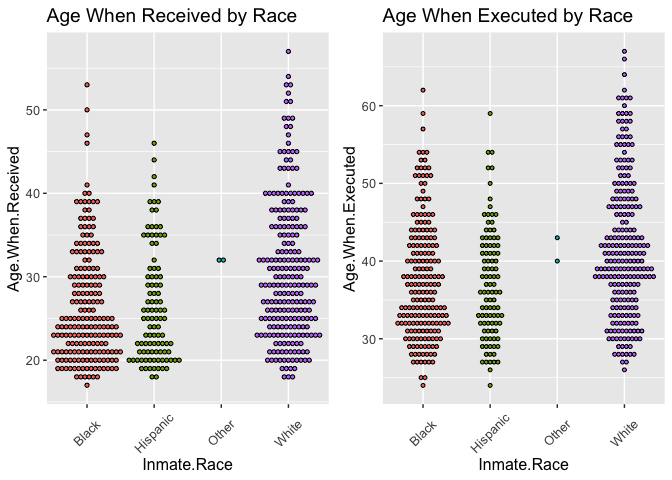
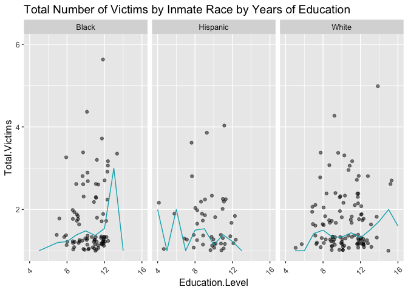
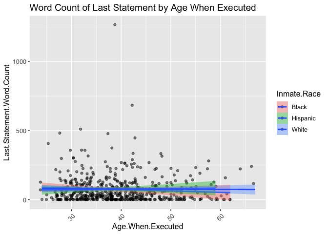

Texas Death Row, Initial Analysis
================
Justin Ehringhaus
October 15, 2022

``` r
# █▀█ █▀▀ █▀ █▀▀ ▀█▀ █▀
# █▀▄ ██▄ ▄█ ██▄ ░█░ ▄█
# clear console
cat("\014")
```



``` r
# clear global environment
rm(list = ls())
# clear plots
try(dev.off(dev.list()["RStudioGD"]), silent = TRUE)
# clear packages
try(p_unload(p_loaded(), character.only = TRUE), silent = TRUE)
# disables scientific notion for entire R session
options(scipen = 100)

# █▀█ ▄▀█ █▀▀ █▄▀ ▄▀█ █▀▀ █▀▀ █▀
# █▀▀ █▀█ █▄▄ █░█ █▀█ █▄█ ██▄ ▄█
library(pacman)
p_load(tidyverse) # the usual suite of packages
p_load(skimr)
p_load(glue)
p_load(onewaytests)
p_load(knitr)
p_load(cowplot)

# █░█ █▀▀ █░░ █▀█ █▀▀ █▀█ █▀
# █▀█ ██▄ █▄▄ █▀▀ ██▄ █▀▄ ▄█
# helper function for generating tibble with important values 
report_values <- function(test, alpha) {
  test.method <- ifelse(
    str_detect(test$method, "Chi-squared"), "chi.squared", "anova")
  switch(test.method,
         "chi.squared" = tibble(
           alpha = alpha,
           degrees = unname(test$parameter),
           cv = round(qchisq(p = alpha, df = degrees, 
                             lower.tail = FALSE), 3),
           test.value = round(unname(test$statistic), 3)),
         "anova" = tibble(
           alpha = alpha,
           df.N = test$parameter[1],
           df.D = test$parameter[2],
           cv = round(qf(p = alpha, 
                         df1 = df.N, df2 = df.D, 
                         lower.tail = FALSE), 2),
           test.value = round(test$statistic, 2)))}

# helper function for making the decision
decision <- function(values) {
  significant <- values$test.value > values$cv
  ifelse(significant == TRUE, 
         glue("Reject the null hypothesis. 
              The test value of {values$test.value} 
              is greater than the critical value of {values$cv}"), 
         glue("Do not reject the null hypothesis. 
              The test value of {values$test.value}
              is less than the critical value of {values$cv}"))}

# helper function for summarizing the result
results <- function(values, hypotheses) {
  significant <- values$test.value > values$cv
  claim <- gsub(" (claim)", "", hypotheses$h1, fixed = TRUE)
  ifelse(significant == TRUE, 
         glue("There is sufficient evidence to support 
              the claim that {claim}."), 
         glue("There is not enough evidence to support 
              the claim that {claim}."))}

# █▀▀ █░░ █▀▀ ▄▀█ █▄░█ █ █▄░█ █▀▀
# █▄▄ █▄▄ ██▄ █▀█ █░▀█ █ █░▀█ █▄█
# source: https://www.kaggle.com/datasets/ianmobbs/texas-death-row-executions-info-and-last-words
death.row1 <- 
  list.files('/Users/justin/Desktop/ALY 6015/Project/data1', full.names = TRUE) %>% 
  lapply(read_csv) %>% 
  bind_rows() %>% 
  rename(`Inmate.Race` = 'Race',
         `Age.When.Executed` = 'Age',
         `Not.Executed.Reason` = 'Reason') %>% 
  select(-Link, -Photo)

# source: https://www.kaggle.com/datasets/mykhe1097/last-words-of-death-row-inmates
death.row2 <- read_csv('/Users/justin/Desktop/ALY 6015/Project/data2/Texas Last Statement.csv') %>% 
  select(`TDCJ Number` = 'TDCJNumber',
         `Age.When.Received` = 'AgeWhenReceived',
         `Education.Level` = 'EducationLevel',
         `Prior.Prison.Record` = 'PreviousCrime',
         `Num.White.Victim` = 'WhiteVictim',
         `Num.Hispanic.Victim` = 'HispanicVictim',
         `Num.Black.Victim` = 'BlackVictim',
         `Num.Other.Race.Victim` = 'VictimOther Races',
         `Num.Female.Victims` = 'FemaleVictim',
         `Num.Male.Victims` = 'MaleVictim')

# source: https://github.com/coreybobco/Texas-Death-Row-Inmate-Webscraper/blob/master/tdcj.csv
death.row3 <- read_csv('/Users/justin/Desktop/ALY 6015/Project/data3/tdcj.csv') %>% 
  select('TDCJ Number',
         Prior.Occupation = 'Prior Occupation')
death.row3 <- death.row3[-c(41),] # data not formatted correctly
death.row3$`TDCJ Number` <- as.numeric(as.character(death.row3$`TDCJ Number`))

death.row <- full_join(death.row1, death.row2, by = 'TDCJ Number')
death.row <- full_join(death.row, death.row3, by = 'TDCJ Number')
rm(death.row1, death.row2, death.row3)

# Checking unique key for duplicates
death.row$`TDCJ Number`[duplicated(death.row$`TDCJ Number`)]
```

    ##  [1] 999442 999203    910 999584 999390 999547 999465 999240 999480    650
    ## [11] 999062 999247 999275 999290 999291 999332 999531 999564 999369 999406
    ## [21] 999260

``` r
# 21 duplicates identified, most of these came from `death.row1`
# For each pair of duplicates, the second is missing more information
death.row %>% filter(`TDCJ Number` == 999584)
```

    ## # A tibble: 2 × 25
    ##   `TDCJ Number` `Last Name` `First Name` `Date of Birth` Gender Inmate.Race
    ##           <dbl> <chr>       <chr>        <chr>           <chr>  <chr>      
    ## 1        999584 Cruz-Garcia Obel         07/08/1967      M      Hispanic   
    ## 2        999584 Cruz-Garcia Obel         <NA>            <NA>   <NA>       
    ## # … with 19 more variables: `Date Received` <chr>, County <chr>,
    ## #   `Date of Offense` <chr>, Nationality <chr>, Date <chr>,
    ## #   Not.Executed.Reason <chr>, `Execution #` <dbl>, Age.When.Executed <dbl>,
    ## #   `Last Statement` <chr>, Age.When.Received <dbl>, Education.Level <dbl>,
    ## #   Prior.Prison.Record <dbl>, Num.White.Victim <dbl>,
    ## #   Num.Hispanic.Victim <dbl>, Num.Black.Victim <dbl>,
    ## #   Num.Other.Race.Victim <dbl>, Num.Female.Victims <dbl>, …

``` r
# Group by primary key, keep only the head, then ungroup
death.row <- death.row %>% group_by(`TDCJ Number`) %>% slice_head() %>% ungroup()
death.row %>% filter(`TDCJ Number` == 999584)
```

    ## # A tibble: 1 × 25
    ##   `TDCJ Number` `Last Name` `First Name` `Date of Birth` Gender Inmate.Race
    ##           <dbl> <chr>       <chr>        <chr>           <chr>  <chr>      
    ## 1        999584 Cruz-Garcia Obel         07/08/1967      M      Hispanic   
    ## # … with 19 more variables: `Date Received` <chr>, County <chr>,
    ## #   `Date of Offense` <chr>, Nationality <chr>, Date <chr>,
    ## #   Not.Executed.Reason <chr>, `Execution #` <dbl>, Age.When.Executed <dbl>,
    ## #   `Last Statement` <chr>, Age.When.Received <dbl>, Education.Level <dbl>,
    ## #   Prior.Prison.Record <dbl>, Num.White.Victim <dbl>,
    ## #   Num.Hispanic.Victim <dbl>, Num.Black.Victim <dbl>,
    ## #   Num.Other.Race.Victim <dbl>, Num.Female.Victims <dbl>, …

``` r
# █▀▀ ▀▄▀ █▀█ █░░ █▀█ █▀█ ▄▀█ ▀█▀ █▀█ █▀█ █▄█
# ██▄ █░█ █▀▀ █▄▄ █▄█ █▀▄ █▀█ ░█░ █▄█ █▀▄ ░█░
# summary of dataset
skim(death.row) %>% select(-starts_with('numeric.p'))
```

|                                                  |           |
|:-------------------------------------------------|:----------|
| Name                                             | death.row |
| Number of rows                                   | 1099      |
| Number of columns                                | 25        |
| \_\_\_\_\_\_\_\_\_\_\_\_\_\_\_\_\_\_\_\_\_\_\_   |           |
| Column type frequency:                           |           |
| character                                        | 13        |
| numeric                                          | 12        |
| \_\_\_\_\_\_\_\_\_\_\_\_\_\_\_\_\_\_\_\_\_\_\_\_ |           |
| Group variables                                  | None      |

Data summary

**Variable type: character**

| skim_variable       | n_missing | complete_rate | min |  max | empty | n_unique | whitespace |
|:--------------------|----------:|--------------:|----:|-----:|------:|---------:|-----------:|
| Last Name           |         0 |          1.00 |   3 |   15 |     0 |      810 |          0 |
| First Name          |         0 |          1.00 |   2 |   11 |     0 |      454 |          0 |
| Date of Birth       |       861 |          0.22 |   8 |   10 |     0 |      237 |          0 |
| Gender              |       861 |          0.22 |   1 |    1 |     0 |        2 |          0 |
| Inmate.Race         |       319 |          0.71 |   5 |    8 |     0 |        5 |          0 |
| Date Received       |       861 |          0.22 |   9 |   10 |     0 |      230 |          0 |
| County              |       319 |          0.71 |   3 |   12 |     0 |      103 |          0 |
| Date of Offense     |       861 |          0.22 |   6 |   10 |     0 |      230 |          0 |
| Nationality         |      1099 |          0.00 |  NA |   NA |     0 |        0 |          0 |
| Date                |       238 |          0.78 |   6 |    8 |     0 |      815 |          0 |
| Not.Executed.Reason |       780 |          0.29 |   7 |  245 |     0 |      296 |          0 |
| Last Statement      |       557 |          0.49 |   2 | 6951 |     0 |      434 |          0 |
| Prior.Occupation    |       962 |          0.12 |   4 |   55 |     0 |       87 |          0 |

**Variable type: numeric**

| skim_variable         | n_missing | complete_rate |      mean |        sd | hist  |
|:----------------------|----------:|--------------:|----------:|----------:|:------|
| TDCJ Number           |         0 |          1.00 | 551363.57 | 496854.69 | ▆▁▁▁▇ |
| Execution \#          |       557 |          0.49 |    271.50 |    156.61 | ▇▇▇▇▇ |
| Age.When.Executed     |       557 |          0.49 |     39.32 |      8.47 | ▅▇▅▂▁ |
| Age.When.Received     |       572 |          0.48 |     28.43 |      7.83 | ▇▆▃▁▁ |
| Education.Level       |       599 |          0.45 |     10.15 |      2.08 | ▁▁▅▇▁ |
| Prior.Prison.Record   |       590 |          0.46 |      0.54 |      0.50 | ▇▁▁▁▇ |
| Num.White.Victim      |       675 |          0.39 |      0.92 |      0.83 | ▇▁▁▁▁ |
| Num.Hispanic.Victim   |       676 |          0.38 |      0.26 |      0.62 | ▇▂▁▁▁ |
| Num.Black.Victim      |       676 |          0.38 |      0.20 |      0.63 | ▇▁▁▁▁ |
| Num.Other.Race.Victim |       676 |          0.38 |      0.03 |      0.21 | ▇▁▁▁▁ |
| Num.Female.Victims    |       573 |          0.48 |      0.68 |      0.78 | ▇▁▁▁▁ |
| Num.Male.Victims      |       573 |          0.48 |      0.71 |      0.69 | ▆▇▁▁▁ |

``` r
# visualization of age received and age executed by race
visualization1 <- 
  death.row %>% 
  select(Age.When.Executed, Age.When.Received, Inmate.Race) %>% 
  drop_na() %>% 
  ggplot +
  aes(x = Inmate.Race, fill = Inmate.Race) +
  geom_dotplot(binaxis = "y", stackdir = "center", binwidth = 0.5, show.legend = FALSE) +
  theme(axis.text.x = element_text(angle = 45, vjust = 0.5, hjust=0.5),
        text = element_text(size = 12))
plot_grid(visualization1 %+% aes(y = Age.When.Received) %+% labs(title = "Age When Received by Race"),
          visualization1 %+% aes(y = Age.When.Executed) %+% labs(title = "Age When Executed by Race"))
```

<!-- -->

``` r
# visualization of 
visualization2 <- 
  death.row %>% 
  filter(!Inmate.Race == "Other") %>% 
  rowwise %>% 
  summarize(Education.Level, Inmate.Race,
            Total.Victims = sum(Num.White.Victim, 
                                Num.Hispanic.Victim, 
                                Num.Black.Victim, 
                                Num.Other.Race.Victim)) %>% 
  # filter(!Inmate.Race == "Other") %>% 
  drop_na() %>% 
  ggplot +
  aes(x = Education.Level, y = Total.Victims) +
  ylim(1, 6) +
  xlim(4, 16) +
  geom_jitter(show.legend = FALSE, alpha = 0.5) +
  stat_summary(geom= "line", fun = "mean", color = "#00AFBB") +
  facet_wrap(~ Inmate.Race) +
  labs(title = "Total Number of Victims by Inmate Race by Years of Education") +
  theme(axis.text.x = element_text(angle = 45, vjust = 0.5, hjust=0.5),
        text = element_text(size = 12))
visualization2
```

<!-- -->

``` r
visualization3 <- 
  death.row %>% 
  select(Inmate.Race, Age.When.Executed, Education.Level, `Last Statement`) %>%
  filter(!Inmate.Race == "Other", !Inmate.Race == "Asian") %>% 
  rowwise %>% 
  summarize(Age.When.Executed,
            Inmate.Race,
            `Last Statement`, 
            Last.Statement.Word.Count = str_count(`Last Statement`, "\\S+")) %>% 
  drop_na() %>% 
  ggplot +
  aes(x = Age.When.Executed, y = Last.Statement.Word.Count, fill = Inmate.Race) +
  geom_jitter(alpha = 0.5) +
  stat_smooth(method = 'lm') +
  labs(title = "Word Count of Last Statement by Age When Executed") +
  theme(axis.text.x = element_text(angle = 45, vjust = 0.5, hjust=0.5),
        text = element_text(size = 12))
visualization3
```

<!-- -->

``` r
# █████
# █▀░██
# ██░██
# ▀▄▄▄▀
###### Log the known information
question1 <- death.row %>% 
  select(Inmate.Race, 
         Num.White.Victim, 
         Num.Hispanic.Victim, 
         Num.Black.Victim, 
         Num.Other.Race.Victim) %>% 
  drop_na() %>% 
  arrange(Inmate.Race) %>% 
  rowwise %>% 
  summarize(Inmate.Race,
            Total.Victims = sum(Num.White.Victim, 
                                Num.Hispanic.Victim, 
                                Num.Black.Victim, 
                                Num.Other.Race.Victim))
            
###### State the hypotheses and identify the claim.
hypotheses <- 
  tibble(
    h0 = "there is no relationship between the race of the inmate and the 
    total number of victims",
    h1 = "there is a relationship between the race of the inmate and the
    total number of victims (claim)")

###### Find the critical value and test value.
one.anova <- aov.test(Total.Victims ~ Inmate.Race, 
                      data = question1, 
                      alpha = 0.05)
```

    ## 
    ##   One-Way Analysis of Variance (alpha = 0.05) 
    ## ------------------------------------------------------------- 
    ##   data : Total.Victims and Inmate.Race 
    ## 
    ##   statistic  : 0.4276729 
    ##   num df     : 3 
    ##   denom df   : 419 
    ##   p.value    : 0.7332725 
    ## 
    ##   Result     : Difference is not statistically significant. 
    ## -------------------------------------------------------------

``` r
values <- report_values(test = one.anova, alpha = one.anova$alpha)
kable(values)
```

| alpha | df.N | df.D |   cv | test.value |
|------:|-----:|-----:|-----:|-----------:|
|  0.05 |    3 |  419 | 2.63 |       0.43 |

``` r
###### Make the decision.
writeLines(decision(values))
```

    ## Do not reject the null hypothesis. 
    ## The test value of 0.43
    ## is less than the critical value of 2.63

``` r
###### Summarize the results.
writeLines(results(values, hypotheses))
```

    ## There is not enough evidence to support 
    ## the claim that there is a relationship between the race of the inmate and the
    ##     total number of victims.

``` r
# ██████
# █▀▄▄▀█
# ██▀▄██
# ▀▄▄▄▄▀
###### Log the known information
question2 <- death.row %>% 
  select(Inmate.Race, 
         Age.When.Executed,
         Age.When.Received) %>% 
  drop_na() %>% 
  arrange(Inmate.Race) %>% 
  rowwise %>% 
  summarize(Inmate.Race,
            Years.On.Death.Row = Age.When.Executed - Age.When.Received)

###### State the hypotheses and identify the claim.
hypotheses <- 
  tibble(
    h0 = "there is no relationship between the race of the inmate and the 
    length of time in years on death row",
    h1 = "there is a relationship between the race of the inmate and the 
    length of time in years on death row (claim)")

###### Find the critical value and test value.
one.anova <- aov.test(Years.On.Death.Row ~ Inmate.Race, 
                      data = question2, 
                      alpha = 0.05)
```

    ## 
    ##   One-Way Analysis of Variance (alpha = 0.05) 
    ## ------------------------------------------------------------- 
    ##   data : Years.On.Death.Row and Inmate.Race 
    ## 
    ##   statistic  : 0.4990076 
    ##   num df     : 3 
    ##   denom df   : 520 
    ##   p.value    : 0.6831227 
    ## 
    ##   Result     : Difference is not statistically significant. 
    ## -------------------------------------------------------------

``` r
values <- report_values(test = one.anova, alpha = one.anova$alpha)
kable(values)
```

| alpha | df.N | df.D |   cv | test.value |
|------:|-----:|-----:|-----:|-----------:|
|  0.05 |    3 |  520 | 2.62 |        0.5 |

``` r
###### Make the decision.
writeLines(decision(values))
```

    ## Do not reject the null hypothesis. 
    ## The test value of 0.5
    ## is less than the critical value of 2.62

``` r
###### Summarize the results.
writeLines(results(values, hypotheses))
```

    ## There is not enough evidence to support 
    ## the claim that there is a relationship between the race of the inmate and the 
    ##     length of time in years on death row.

``` r
# ██████
# █▄▄▄░█
# ██▄▄░█
# ▀▄▄▄▄▀
###### Log the known information
question3 <- death.row %>% 
  select(Inmate.Race, 
         Num.White.Victim, 
         Num.Hispanic.Victim, 
         Num.Black.Victim, 
         Num.Other.Race.Victim) %>% 
  drop_na() %>% 
  group_by(Inmate.Race) %>% 
  summarize(Num.White.Victim = sum(Num.White.Victim),
            Num.Hispanic.Victim = sum(Num.Hispanic.Victim),
            Num.Black.Victim = sum(Num.Black.Victim),
            Num.Other.Race.Victim = sum(Num.Other.Race.Victim)) %>% 
  subset(select = -Inmate.Race)
question3 <- as.data.frame(question3)
rownames(question3) <- c('Black', 'Hispanic', 'Other', 'White')

###### State the hypotheses and identify the claim.
hypotheses <- 
  tibble(
    h0 = "the race of the inmate is independent of the race of the victims",
    h1 = "the race of the inmate is dependent upon the race of the victims (claim)")

###### Find the critical value and test value.
chi.sq <- chisq.test(question3)
values <- report_values(test = chi.sq, alpha = 0.05)
kable(values)
```

| alpha | degrees |     cv | test.value |
|------:|--------:|-------:|-----------:|
|  0.05 |       9 | 16.919 |    441.714 |

``` r
###### Make the decision.
writeLines(decision(values))
```

    ## Reject the null hypothesis. 
    ## The test value of 441.714 
    ## is greater than the critical value of 16.919

``` r
###### Summarize the results.
writeLines(results(values, hypotheses))
```

    ## There is sufficient evidence to support 
    ## the claim that the race of the inmate is dependent upon the race of the victims.

``` r
# ██████
# █░█░██
# █▄▄░██
# ▀▀▄▄▄▀
###### Log the known information
question4 <- death.row %>% 
  select(Prior.Prison.Record, Education.Level) %>% 
  drop_na() %>% 
  table() %>% 
  as.data.frame.matrix()
rownames(question4) <- c('No', 'Yes')

###### State the hypotheses and identify the claim.
hypotheses <- 
  tibble(
    h0 = "the existence of a previous offense is independent of the level of education",
    h1 = "the existence of a previous offense is dependent upon the level of education (claim)")

###### Find the critical value and test value.
chi.sq <- chisq.test(question4)
values <- report_values(test = chi.sq, alpha = 0.05)
kable(values)
```

| alpha | degrees |     cv | test.value |
|------:|--------:|-------:|-----------:|
|  0.05 |      13 | 22.362 |     23.598 |

``` r
###### Make the decision.
writeLines(decision(values))
```

    ## Reject the null hypothesis. 
    ## The test value of 23.598 
    ## is greater than the critical value of 22.362

``` r
###### Summarize the results.
writeLines(results(values, hypotheses))
```

    ## There is sufficient evidence to support 
    ## the claim that the existence of a previous offense is dependent upon the level of education.

``` r
# ██████
# █░▄▄▄█
# █▄▄▄▒█
# ▀▄▄▄▄▀
###### Log the known information
question5 <- death.row %>% 
  select(Inmate.Race, Education.Level) %>% 
  drop_na() %>% 
  table() %>% 
  as.data.frame.matrix()

###### State the hypotheses and identify the claim.
hypotheses <- 
  tibble(
    h0 = "the race of the inmate is independent of the level of education",
    h1 = "the race of the inmate is dependent upon the level of education (claim)")

###### Find the critical value and test value.
chi.sq <- chisq.test(question5)
values <- report_values(test = chi.sq, alpha = 0.05)
kable(values)
```

| alpha | degrees |     cv | test.value |
|------:|--------:|-------:|-----------:|
|  0.05 |      42 | 58.124 |     69.392 |

``` r
###### Make the decision.
writeLines(decision(values))
```

    ## Reject the null hypothesis. 
    ## The test value of 69.392 
    ## is greater than the critical value of 58.124

``` r
###### Summarize the results.
writeLines(results(values, hypotheses))
```

    ## There is sufficient evidence to support 
    ## the claim that the race of the inmate is dependent upon the level of education.

``` r
# █▀▄ █▀▀ █▀ ▀█▀ █▀█ █▀█ █▄█
# █▄▀ ██▄ ▄█ ░█░ █▀▄ █▄█ ░█░
rm(hypotheses, chi.sq, one.anova, values)
```
