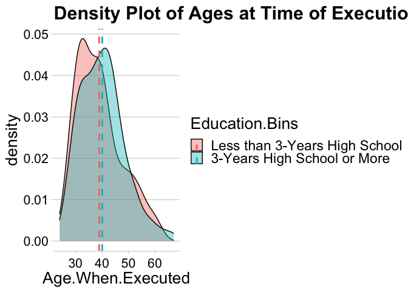

Death Row Analysis
================
Justin Ehringhaus and Lauren Todaro
October 28, 2022

``` r
# █▀█ █▀▀ █▀ █▀▀ ▀█▀ █▀
# █▀▄ ██▄ ▄█ ██▄ ░█░ ▄█
# clear console
cat("\014")
```



``` r
# clear global environment
rm(list = ls())
# clear plots
try(dev.off(dev.list()["RStudioGD"]), silent = TRUE)
# clear packages
try(p_unload(p_loaded(), character.only = TRUE), silent = TRUE)
# disables scientific notion for entire R session
options(scipen = 100)

# █▀█ ▄▀█ █▀▀ █▄▀ ▄▀█ █▀▀ █▀▀ █▀
# █▀▀ █▀█ █▄▄ █░█ █▀█ █▄█ ██▄ ▄█
library(pacman)
p_load(tidyverse) # the usual suite of packages
p_load(glue)
p_load(onewaytests)
p_load(knitr)
p_load(tm)
p_load(wordcloud2)
p_load(tidytext)
p_load(textdata)
p_load(cowplot)
p_load(gridExtra)

# █░█ █▀▀ █░░ █▀█ █▀▀ █▀█ █▀
# █▀█ ██▄ █▄▄ █▀▀ ██▄ █▀▄ ▄█
# Outputs a (glue) string, prettified for console printing
pretty_glue <- function(string, misc = NULL) {
  border <- strrep('*', 80)
  eval.string <- glue(string)
  return(cat(border, eval.string, border, sep = '\n'))
}

interpret.results <- 
  function(misc) {
    misc$decision <- 
      ifelse(misc$significant,
             paste("Reject the null hypothesis.", 
                   "There is enough evidence to", 
                   ifelse(misc$claim == 'h0', "reject", "support"), 
                   "the claim "),
             paste("Do not reject the null hypothesis.", 
                   "\nThere is not enough evidence to", 
                   ifelse(misc$claim == 'h0', "reject", "support"),
                   "the claim "))
    pretty_glue("Hypotheses and claim:
                 h0: {misc$h0}
                 h1: {misc$h1}
                 claim: {misc$claim}\n
                 Alpha:
                 {misc$alpha}\n
                 Critical value(s):
                 {misc$cv}\n
                 Test statistic:
                 {misc$test.statistic}\n
                 Decision:
                 {misc$decision}{misc$claim}.", misc)
  }

wilcoxon.rank.sum.test <- 
  function(data, misc) {
    n1 <- length(data[[1]])
    n2 <- length(data[[2]])
    sort.rank.combine.numerical.vectors <- 
      function(data) {
        data <- setNames(unlist(data, use.names = F), 
                         rep(names(data), lengths(data)))
        sorted <- sort(data)
        ranked <- rank(sorted, ties.method = "average")
        combined <- rbind(sorted, ranked)
        return(combined)
      }
    combined <- sort.rank.combine.numerical.vectors(data)
    lesser <- with(plyr::count(names(combined[1,])), x[which.min(freq)])
    R <- sum(combined['ranked', ][names(combined['ranked', ]) == lesser])
    mu.R <- (n1 * (n1 + n2 + 1)) / 2
    sg.R <- sqrt(((n1 * n2) * (n1 + n2 + 1)) / 12)
    misc$test.statistic <- 
      round((R - mu.R) / sg.R, 2)
    misc$significant <- 
      switch(misc$alternative,
             "two.sided" = !between(misc$test.statistic, -misc$cv, misc$cv),
             "greater" = misc$test.statistic > misc$cv,
             "lesser" = misc$test.statistic < misc$cv)
    misc$cv <- 
      ifelse(misc$alternative == 'two.sided', 
             paste('±', misc$cv), 
             misc$cv)
    interpret.results(misc)
  }

# █▀▀ █░░ █▀▀ ▄▀█ █▄░█ █ █▄░█ █▀▀
# █▄▄ █▄▄ ██▄ █▀█ █░▀█ █ █░▀█ █▄█
# source: https://www.kaggle.com/datasets/ianmobbs/texas-death-row-executions-info-and-last-words
death.row1 <- 
  list.files('/Users/justin/Desktop/ALY 6015/Project/data1', full.names = TRUE) %>% 
  lapply(read_csv) %>% 
  bind_rows() %>% 
  rename(`Inmate.Race` = 'Race',
         `Age.When.Executed` = 'Age',
         `Not.Executed.Reason` = 'Reason') %>% 
  select(-Link, -Photo)

# source: https://www.kaggle.com/datasets/mykhe1097/last-words-of-death-row-inmates
death.row2 <- 
  read_csv('/Users/justin/Desktop/ALY 6015/Project/data2/Texas Last Statement.csv') %>% 
  select(`TDCJ Number` = 'TDCJNumber',
         `Age.When.Received` = 'AgeWhenReceived',
         `Education.Level` = 'EducationLevel',
         `Prior.Prison.Record` = 'PreviousCrime',
         `Num.White.Victim` = 'WhiteVictim',
         `Num.Hispanic.Victim` = 'HispanicVictim',
         `Num.Black.Victim` = 'BlackVictim',
         `Num.Other.Race.Victim` = 'VictimOther Races',
         `Num.Female.Victims` = 'FemaleVictim',
         `Num.Male.Victims` = 'MaleVictim')

# source: https://github.com/coreybobco/Texas-Death-Row-Inmate-Webscraper/blob/master/tdcj.csv
death.row3 <- 
  read_csv('/Users/justin/Desktop/ALY 6015/Project/data3/tdcj.csv') %>% 
  select('TDCJ Number',
         Prior.Occupation = 'Prior Occupation')
death.row3 <- death.row3[-c(41),] # data not formatted correctly
death.row3$`TDCJ Number` <- as.numeric(as.character(death.row3$`TDCJ Number`))

# source: assigning sentiment categories manually to each last statement
death.row4 <- 
  read_csv('/Users/justin/Desktop/ALY 6015/Project/data4/sentiments.csv') %>% 
  select('TDCJ Number', 'Sentiment')

# Joining disparate sources by primary key
death.row <- full_join(death.row1, death.row2, by = 'TDCJ Number')
death.row <- full_join(death.row, death.row3, by = 'TDCJ Number')
death.row <- full_join(death.row, death.row4, by = 'TDCJ Number')
rm(death.row1, death.row2, death.row3, death.row4)

# Checking unique key for duplicates
death.row$`TDCJ Number`[duplicated(death.row$`TDCJ Number`)]
```

    ##  [1] 999442 999203    910 999584 999390 999547 999465 999240 999480    650
    ## [11] 999062 999247 999275 999290 999291 999332 999531 999564 999369 999406
    ## [21] 999260

``` r
# 21 duplicates identified, most of these came from `death.row1`
# For each pair of duplicates, the second is missing more information
death.row %>% filter(`TDCJ Number` == 999584)
```

    ## # A tibble: 2 × 26
    ##   `TDCJ Number` `Last Name` `First Name` `Date of Birth` Gender Inmate.Race
    ##           <dbl> <chr>       <chr>        <chr>           <chr>  <chr>      
    ## 1        999584 Cruz-Garcia Obel         07/08/1967      M      Hispanic   
    ## 2        999584 Cruz-Garcia Obel         <NA>            <NA>   <NA>       
    ## # … with 20 more variables: `Date Received` <chr>, County <chr>,
    ## #   `Date of Offense` <chr>, Nationality <chr>, Date <chr>,
    ## #   Not.Executed.Reason <chr>, `Execution #` <dbl>, Age.When.Executed <dbl>,
    ## #   `Last Statement` <chr>, Age.When.Received <dbl>, Education.Level <dbl>,
    ## #   Prior.Prison.Record <dbl>, Num.White.Victim <dbl>,
    ## #   Num.Hispanic.Victim <dbl>, Num.Black.Victim <dbl>,
    ## #   Num.Other.Race.Victim <dbl>, Num.Female.Victims <dbl>, …

``` r
# Group by primary key, keep only the head, then ungroup
death.row <- death.row %>% group_by(`TDCJ Number`) %>% slice_head() %>% ungroup()
death.row %>% filter(`TDCJ Number` == 999584)
```

    ## # A tibble: 1 × 26
    ##   `TDCJ Number` `Last Name` `First Name` `Date of Birth` Gender Inmate.Race
    ##           <dbl> <chr>       <chr>        <chr>           <chr>  <chr>      
    ## 1        999584 Cruz-Garcia Obel         07/08/1967      M      Hispanic   
    ## # … with 20 more variables: `Date Received` <chr>, County <chr>,
    ## #   `Date of Offense` <chr>, Nationality <chr>, Date <chr>,
    ## #   Not.Executed.Reason <chr>, `Execution #` <dbl>, Age.When.Executed <dbl>,
    ## #   `Last Statement` <chr>, Age.When.Received <dbl>, Education.Level <dbl>,
    ## #   Prior.Prison.Record <dbl>, Num.White.Victim <dbl>,
    ## #   Num.Hispanic.Victim <dbl>, Num.Black.Victim <dbl>,
    ## #   Num.Other.Race.Victim <dbl>, Num.Female.Victims <dbl>, …

``` r
# adding variable `Education.Bins`
death.row <- 
  death.row %>% 
  mutate(Education.Bins = cut(Education.Level, breaks = c(0, 10, 20),
                              labels = c("Less than 3-Years High School", 
                                         "3-Years High School or More")),
         .after = "Education.Level")

# adding variable `Years.On.Death Row`
death.row <- 
  death.row %>% 
  mutate(Years.On.Death.Row = Age.When.Executed - Age.When.Received,
         .after = "Age.When.Executed")
# fixing data entry error, should never be negative
death.row$Years.On.Death.Row[death.row$Years.On.Death.Row < 0] <- 0

# adding variable `Total.Victims`
death.row <- 
  death.row %>%  
  rowwise() %>% 
  mutate(Total.Victims = sum(Num.Male.Victims, Num.Female.Victims),
                             .after = `Num.Male.Victims`)

# Cleaning `Last Statement` for word cloud visualization
death.row$`Last Statement` <- iconv(death.row$`Last Statement`, 
                                    from = 'UTF-8', to = 'ASCII//TRANSLIT')
death.row$`Last Statement`[death.row$`Last Statement` == "None"] <- NA
# corpus
statements.corpus <- Corpus(VectorSource(death.row$`Last Statement`))
# before text cleaning
inspect(statements.corpus[85])
```

    ## <<SimpleCorpus>>
    ## Metadata:  corpus specific: 1, document level (indexed): 0
    ## Content:  documents: 1
    ## 
    ## [1] I would like to thank my Lord Jesus Christ for keeping me strong all these years. I would also like to thank my mother for standing by me all these years. I would also like to thank my pen pals, Joe and Camille Tilling and JoAnn for helping me stay strong all these years. I also thank my two lawyers, Rita and Brent, for fighting to keep me alive. I love you, Mom -

``` r
# Convert the text to lower case
statements.corpus <- tm_map(statements.corpus, tolower)
# Remove numbers
statements.corpus <- tm_map(statements.corpus, removeNumbers)
# Remove punctuations
statements.corpus <- tm_map(statements.corpus, removePunctuation)
# Eliminate extra white spaces
statements.corpus <- tm_map(statements.corpus, stripWhitespace)
# Remove common English stopwords
statements.corpus <- tm_map(statements.corpus, removeWords, stopwords("english"))
# Text stemming
statements.corpus <- tm_map(statements.corpus, stemDocument)
# after text cleaning
inspect(statements.corpus[85])
```

    ## <<SimpleCorpus>>
    ## Metadata:  corpus specific: 1, document level (indexed): 0
    ## Content:  documents: 1
    ## 
    ## [1] like thank lord jesus christ keep strong year also like thank mother stand year also like thank pen pal joe camill till joann help stay strong year also thank two lawyer rita brent fight keep aliv love mom

``` r
# █▀▀ ▀▄▀ █▀█ █░░ █▀█ █▀█ ▄▀█ ▀█▀ █▀█ █▀█ █▄█
# ██▄ █░█ █▀▀ █▄▄ █▄█ █▀▄ █▀█ ░█░ █▄█ █▀▄ ░█░
visualization <- 
  death.row %>% 
  select(Inmate.Race, Years.On.Death.Row, Total.Victims, Education.Bins,
         Age.When.Received, Age.When.Executed) %>% 
  drop_na() %>% 
  ggplot +
  aes() +
  theme_minimal_hgrid() +
  theme(axis.text.x = element_text(angle = 45, vjust = 0.5, hjust = 0.5),
        text = element_text(size = 20),
        axis.text = element_text(size = 16))

# Dot plot, visualization #1
years.on.death.row.by.race <- 
  visualization %+% 
  aes(x = Inmate.Race, y = Years.On.Death.Row, fill = Inmate.Race) +
  geom_dotplot(binaxis = "y", stackdir = "center", binwidth = 0.45, show.legend = FALSE) +
  ylim(0, 30) +
  labs(title = "Years on Death Row by Race")
years.on.death.row.by.race
```

<!-- -->

``` r
# Density plot, visualization #2
age.executed.by.education <- 
  visualization %+% 
  aes(Age.When.Executed) +
  geom_density(aes(fill = Education.Bins), alpha = 0.4) +
  labs(title = "Density Plot of Ages at Time of Execution by Education Level") +
  geom_vline(data = . %>% 
               group_by(Education.Bins) %>%
               summarize(mean.age.exeucted.by.edu = mean(Age.When.Executed)),
             aes(xintercept = mean.age.exeucted.by.edu,
                 color = Education.Bins), 
             size = 1,
             linetype = "dashed") +
  theme(axis.text.x = element_text(angle = 0))
age.executed.by.education
```

<!-- -->

``` r
# Word cloud, visualization #3
TermDocumentMatrix(statements.corpus)
```

    ## <<TermDocumentMatrix (terms: 2174, documents: 1099)>>
    ## Non-/sparse entries: 11318/2377908
    ## Sparsity           : 100%
    ## Maximal term length: 14
    ## Weighting          : term frequency (tf)

``` r
tdm <- TermDocumentMatrix(statements.corpus)
# a glimpse at the matrix
inspect(tdm[1:5, 1:5])
```

    ## <<TermDocumentMatrix (terms: 5, documents: 5)>>
    ## Non-/sparse entries: 0/25
    ## Sparsity           : 100%
    ## Maximal term length: 6
    ## Weighting          : term frequency (tf)
    ## Sample             :
    ##         Docs
    ## Terms    1 2 3 4 5
    ##   famili 0 0 0 0 0
    ##   forgiv 0 0 0 0 0
    ##   pray   0 0 0 0 0
    ##   rejoic 0 0 0 0 0
    ##   thank  0 0 0 0 0

``` r
tdm <- as.matrix(tdm)
v <- sort(rowSums(tdm), decreasing=TRUE)
d <- data.frame(word = names(v), freq = v)
w <- data.frame(names(v), v)
colnames(w) <- c('word', 'freq')
set.seed(1234)
wordcloud2(w, size = 0.7, shape = 'triangle', rotateRatio = 0.5, minSize = 1)
```

<div id="htmlwidget-1b4ff99564eb6e8884a5" style="width:672px;height:480px;" class="wordcloud2 html-widget"></div>
<script type="application/json" data-for="htmlwidget-1b4ff99564eb6e8884a5">{"x":{"word":["love","know","famili","will","thank","sorri","want","yall","god","forgiv","like","say","just","life","lord","one","dont","take","hope","tell","yes","see","peac","give","can","peopl","ask","jesus","come","warden","keep","done","let","father","get","strong","heart","friend","kill","right","readi","everybodi","pain","time","happen","death","bless","that","man","pray","thing","support","stay","find","year","home","now","care","back","caus","day","innoc","pleas","mom","brother","heaven","never","got","make","may","sir","didnt","everyth","alway","help","live","apolog","everyon","ill","christ","lot","way","cant","first","good","sister","much","wish","bring","said","son","die","hurt","head","murder","noth","world","statement","name","wrong","feel","look","must","need","hate","still","someth","allah","realli","put","continu","today","tonight","suffer","appreci","everi","person","row","thi","last","anyth","ever","place","holi","truli","merci","victim","sin","stop","chang","closur","mean","ive","understand","mother","truth","believ","better","spirit","happi","move","shall","talk","told","think","kid","guy","best","end","word","stand","commit","long","rememb","execut","well","sure","prais","made","even","john","daughter","soul","lie","side","crime","goodby","amen","part","letter","alright","real","call","court","strength","wit","wife","dad","iren","fight","two","tri","faith","togeth","mistak","took","babi","els","okay","show","hous","save","mama","though","leav","momma","jack","hear","justic","trial","wait","littl","mani","great","hold","black","children","forward","gonna","offic","attorney","earth","bye","free","gave","goe","beauti","forev","anyon","worri","glad","thought","deserv","america","anybodi","evil","bad","wont","cri","mad","watch","also","fear","power","dear","hand","learn","without","prayer","allow","forgiven","given","kingdom","parent","use","comfort","thou","reason","respons","ago","carri","away","work","brought","state","later","forget","texa","eye","promis","touch","walk","wasnt","your","someday","accept","chaplain","return","respect","face","lynch","march","past","receiv","mrs","confess","lost","nobodi","came","left","mine","member","hard","none","gone","taken","countri","matter","start","wonder","toward","guilti","send","grace","art","lead","trespass","address","point","somebodi","kind","smile","extend","meant","loss","rest","fine","unto","chanc","glori","moment","lawyer","david","kathi","precious","present","fact","evid","prove","unit","human","whole","remors","youv","judg","true","written","knew","record","shown","angel","full","follow","sake","donna","michael","convict","three","ahead","aint","miss","prison","soon","polic","pay","final","sentenc","bodi","express","media","drug","anoth","around","bobbi","finish","freedom","gain","grave","men","next","struggl","situat","girl","act","daili","deliv","bear","proud","probabl","turn","honor","prophet","deal","mind","rais","hell","sleep","spanish","doesnt","friendship","abl","angri","went","bitter","punish","mari","system","there","sinc","disappoint","penalti","victori","child","enemi","pass","stuff","beat","couldnt","sincer","unintellig","christian","press","case","bread","temptat","price","special","dead","fix","rosalyn","short","guess","night","wrote","jame","reach","big","set","lay","besid","anger","speak","grief","shot","answer","almighti","boswel","begin","sing","gun","sad","daddi","someon","adam","polunski","joe","problem","realiz","mumbl","shed","water","behind","king","law","liber","public","robert","upon","prosecutor","jenni","young","hallow","dog","job","listen","regret","wake","spiritu","nice","tabl","journey","road","saw","charg","dwell","salvat","forc","proceed","yeah","green","path","shepherd","dna","gift","seek","hey","aunt","mexico","opportun","involv","sorrow","church","hatr","futur","affect","suppos","capit","open","sometim","second","roman","leadeth","blame","nephew","buri","veronica","rejoic","due","societi","becom","coupl","protect","tear","aveng","defens","demand","endur","file","genocid","guilt","heard","high","injustic","lambert","necessari","poor","reverend","theyv","video","what","win","whatev","owe","profan","scott","hug","creat","meet","savior","explain","fail","mike","parti","testimoni","walsh","husband","whitesid","wilcox","fake","paid","total","releas","spoken","divin","etern","monster","arm","johnson","chris","cup","oil","pastur","preparest","presenc","runneth","shadow","valley","yea","alreadi","folk","sooner","joy","laugh","lift","woe","hallelujah","voic","english","write","yet","ran","gotta","shoot","remain","laura","accid","action","fire","wall","west","thine","conni","physic","upset","celebr","experi","thoma","throughout","ami","tast","lose","rebecca","tragedi","hour","miracl","danni","pull","wouldnt","relief","perfect","pop","cox","niec","began","dungeon","vein","uncl","jennif","gomez","brad","carlo","memori","resolv","fought","minut","spoke","aliv","till","prepar","purpos","richard","mayb","met","other","acknowledg","assur","close","communiti","forgotten","gari","jackson","kept","messag","moratorium","nation","protest","revolut","sanction","stood","tape","especi","hang","staff","islam","spent","incid","type","pam","treat","juri","account","bro","complet","destroy","doubt","enough","exist","gene","govern","harm","hawthorn","hunt","import","shoe","longer","gracious","poem","differ","doctor","robinson","ros","tight","rock","roll","american","hero","least","new","guid","found","anyway","cost","seem","anointest","test","cross","sandi","virginia","behold","fill","greatest","weep","dell","fault","jone","easi","morgan","sky","cousin","barbara","crazi","sinner","solac","damn","hart","maria","bed","sever","worth","offici","hello","mighti","triniti","blood","dealer","month","possibl","woman","animos","deepli","paul","invit","kehler","terribl","individu","doreen","imagin","forgav","solv","alter","money","killer","joke","ladi","ronni","trigger","pastor","tom","grandmoth","boy","known","dow","alon","anthoni","self","truck","kim","saint","august","count","street","william","needl","play","deep","within","isnt","robin","maketh","restoreth","heal","suprem","leo","correct","trust","grant","belong","book","bump","mauri","doug","grate","unjust","agre","herebi","decis","susan","debt","mark","brent","pen","determin","muslim","taught","teenag","violenc","cherish","mankind","approach","embrac","event","minist","separ","tongu","unknown","across","admit","bianca","civil","compromis","destini","digniti","expos","graham","intern","jess","leader","mandela","martin","moham","order","period","prevail","proper","queen","racist","refus","revolutionari","sankofa","shaka","south","suit","surrend","theyr","uniti","warrior","direct","fellowship","shower","deceas","discipl","energi","regard","unfortun","line","alcohol","stole","stori","bill","andi","ann","dixi","rusti","sonni","counsel","feloni","persecut","reveng","afford","beyond","booger","comment","debbi","devast","district","gotten","hes","inform","institut","newspap","oneey","remind","result","zero","room","lopez","flesh","flight","behalf","serious","brief","cindi","along","choos","finit","infinit","knowledg","north","paradis","perform","race","surgeri","betti","everlast","sean","where","late","might","pleasur","webb","dan","harri","kay","synnova","tim","bottom","california","school","sent","allison","repent","all","don","ministri","righteous","rod","irish","translat","ass","kiss","white","troubl","ride","cadena","gurney","sheila","whoever","cast","chapter","diamond","fals","gentl","hunger","mcbride","morn","patient","rich","rush","shine","sign","soft","unright","fall","exampl","genuin","brotherinlaw","list","pat","roger","teach","read","verbal","particular","robberi","fellow","provid","allen","loui","hardest","step","stone","activ","awak","appeal","patienc","bedroom","east","front","jane","run","seven","burden","counti","fabric","swear","cruel","thee","dio","harder","todo","chief","clay","courtroom","frustrat","half","violent","quiero","build","sweet","born","malic","sanchez","guido","funer","light","mass","although","horribl","clean","wipe","singl","lock","grandchildren","argument","fair","falsifi","illeg","mason","somewher","whos","atroc","dust","omit","portion","throne","tiffani","calm","wing","corey","kin","breath","tommi","deni","easier","greater","inflict","melyssa","claim","intent","amber","respond","megan","england","charlott","disrespect","clear","davi","celina","peter","arnott","kenney","shame","rape","transcript","daniell","nine","number","whether","neither","hospit","closer","danc","arriv","stronger","harbor","yolanda","ideal","mess","sadden","shout","despit","anymor","either","felt","viva","shalt","quit","stupid","maker","randi","sis","wors","guidanc","compar","rose","negat","youll","hernandez","suicid","foremost","roxann","sylvia","uncondit","tire","eight","brenda","grew","diann","frank","realiti","dope","loud","vick","damien","break","investig","ray","stuck","transit","ashle","grandbabi","mourn","kyle","dawn","hewitt","gate","fullest","old","chantal","devil","excus","dwight","ranger","stefani","weve","straight","courtesi","marcus","rhode","error","check","joey","alison","frederick","health","rebat","refund","trade","treasur","camill","joann","pal","rita","absolut","devout","materi","oneself","cool","inmat","veteran","merka","plead","garbl","ken","timeoh","conscious","lip","ocean","argu","bicker","desir","glorious","grumah","likeit","maximum","minimum","mycountri","nectar","nourish","poet","secur","tree","tribe","wast","african","anywher","ashanti","barbar","battl","brutal","chimurenga","compel","condit","courag","door","endeavor","jagger","legal","less","loos","luther","maintain","malcom","murderlynch","nelson","outlaw","outrag","overcom","overwhelm","preach","pure","pursu","push","ralli","recogn","resist","sharpton","simpl","slaveri","solidar","string","systemat","tradit","war","winni","mccarthi","flow","certain","devot","discomfort","drawn","instrument","ireland","iri","mishap","rescu","siff","unintent","wretch","bitch","howard","blacki","buster","carla","fran","milo","add","allwhit","assist","blind","borderlin","contamin","discrimin","ineffect","male","option","pile","plus","rehabilit","retard","centuri","held","quarter","simpli","unwav","actual","base","bigger","bug","complaint","cuba","doodl","embargo","environ","except","floor","iran","iraq","observ","ongo","perhap","planet","recent","redoctor","spin","symptom","tenni","unforgiv","verifi","advisor","obrien","anni","crucifi","aviat","ahh","background","educ","fashion","figur","fixin","form","guarante","permiss","scene","wherefor","bryant","slumber","approxim","bassinet","colleen","wet","willi","deepest","rosenbaum","ancient","assign","central","dorothi","era","forefath","master","religion","reveal","strang","templ","toma","univers","mansion","marino","marsha","youalway","bestow","despic","obtain","patricia","patti","replac","speech","chicken","chop","fella","fleetwood","pork","rene","rodney","segal","spade","wynona","author","outlin","penitentiari","pin","reformatori","youth","margi","mchenri","resurrect","satan","servant","slave","whenev","brian","moon","shane","restor","hire","sharon","wilson","famous","infam","legendari","matt","turner","bruce","lovel","thirti","magnific","travesti","mage","offens","key","sacrific","small","wealth","barbado","island","shut","caught","four","pictur","shannon","theyll","abid","arrog","autumn","awaken","beatitud","bird","brag","ceas","circl","compani","consol","corinthian","glint","grain","huntsvill","hush","jealous","leap","manner","moan","propheci","provok","quiet","rain","reproach","reward","ripen","snow","star","sunlight","supremaci","swift","unbecom","uplift","gaylen","commenc","concern","entir","testifi","dich","german","herz","ich","liel","menic","princess","prizessin","rind","schone","seel","sehm","yoli","becca","charl","everywher","hun","neckbon","pound","sheet","weigh","wei","gloria","misl","attitud","fourteen","gas","manon","noncar","pepper","politician","process","thirteen","ursula","warm","departur","join","judgement","lack","plane","relat","whose","winthin","anna","celest","cort","jason","demonstr","flag","havent","temporari","maggi","danalyn","dilig","humphrey","hurri","intend","owen","recit","understood","werent","donovan","elizabeth","kelli","twelv","honey","ashworth","bullet","fort","laid","larri","match","molest","pattern","report","request","third","invest","june","lubbock","travi","ware","ancestor","french","grudg","justspeak","levi","lundi","meanheart","brigitta","noel","thick","thin","debtor","earli","isabel","rise","sea","song","bea","gilbert","nanni","alabamo","command","contigo","cuida","espiritu","familia","huh","manda","moral","slayton","becam","car","chronicl","control","coverup","crack","dea","earlier","five","houston","injuri","juror","mayor","midsent","react","reflex","selfdefens","theoffend","unprovok","santajaib","singh","consulado","decir","gracia","mucha","mucho","por","walshsylvia","claudia","amaz","faceti","fro","yield","pope","todeschini","burn","candl","cleans","foundat","shineth","crain","question","fruit","judgment","contact","grandfath","jefe","inexcus","mental","worthwhil","eras","slate","cutler","thompson","ayer","alba","eric","hector","jake","mia","papa","sabrina","wendi","kami","conspiraci","contradict","document","general","paper","rebut","sell","signatur","skain","sputnick","beg","calvari","worthi","gabbi","graci","katrina","dwyer","elimin","cancel","commend","cruz","javier","lesli","miguel","diana","meit","steal","undertak","melode","ricki","thier","andr","jessica","lorna","overcam","potenti","amend","koslow","soften","biggest","bryan","cleve","foster","hine","knight","lee","patrick","steve","taylor","wood","hayden","sullivan","joseph","linda","unabl","describ","safe","angelo","carma","edi","margherita","diego","switzerland","wildflow","audrey","judi","tammi","baisey","nesha","shan","titus","garza","mommi","cullen","dozen","eastham","jami","kent","kinslow","perkin","younger","effort","lorrel","caller","chiara","christi","corpus","crouch","daniel","fred","moreno","oralia","peterson","rachel","cheap","grown","hollow","abul","anitra","needand","defenseand","holder","howdi","paus","abus","drive","hadnt","hilton","newman","rob","bohannon","peg","watkin","shouldnt","void","track","almost","carl","dude","instead","safer","shorti","dealt","herrington","flake","iam","selfdestruct","anderson","christina","gold","granni","river","visit","grandma","sarah","vocabulari","worst","celia","guajardo","orlando","arent","clash","conflict","difficult","dispos","emot","fell","heinous","idl","instanc","justicetonight","luttig","meand","misguid","particip","recov","resound","restraint","scream","senseless","threat","undo","uphold","enlighten","forest","hall","imperfect","pillar","michell","crook","terrella","ultim","anointeth","appear","chosen","eas","farri","grab","helper","injur","pressur","proof","surpris","chiquita","baker","begotten","believeth","deed","jump","mouth","psalm","vengeanc","vers","wage","whosoev","wrath","overlook","cca","cheat","circuit","feder","nanci","poison","chad","ground","parol","reed","reserv","solid","cynthia","mija","basi","consid","lucki","sens","deidra","gigi","olli","amenia","countless","cours","gabriell","germani","kira","nadia","noemi","uhl","bit","meal","carrier","gerard","harold","ieisha","kaneisha","ach","crush","dark","enabl","helen","hopeless","isol","joanna","luis","pit","resid","satisfact","suppress","terrfi","terrifi","unforgives","ambit","asham","chose","edwin","satisfi","shawn","blackwel","franciscan","kindom","nun","paulett","serv","shore","tanni","teresa","yellow","brandi","gray","pact","vicent","jermain","mario","gabriel","hinder","kevin","nervous","themand","devin","gus","heroin","immatur","methadon","walt","feet","headphon","popsicl","speaker","didmau","vietnames","exoner","mcdougal","tolson","consequ","darl","kerstin","repriev","aleda","solitari","varghes","becauseend","choke","decemb","falicia","interview","prechtl","annett","catacomb","chain","misti","otherwis","shackl","earlin","adela","bob","bros","deena","juana","mijta","repay","victor","kick","tobi","wright","surac","abraham","farooq","bounc","aid","attack","bathroom","career","cdl","confus","crimin","cut","dalla","deaf","downtown","driver","ear","fam","favor","hit","jonesin","pick","polygraph","sold","stab","tact","throat","volunt","yard","trooper","dori","doubl","oversea","stunt","abel","armando","asthma","cassandra","closet","delia","evelyn","hair","herb","hot","josh","leg","lent","shirt","eve","gomorrah","priceless","saddam","alaikum","assalaam","bruno","chucki","juanita","profess","chelsea","dyson","johnni","melissa","roseann","tito","choic","peanut","tore","aaron","campbel","darrian","grass","asid","broke","cemeteri","cover","debra","diaper","greer","marci","michigan","overplay","sammi","schaeffer","vincent","ward","wear","wed","barker","brandon","carolyn","kinda","settl","tina","jayi","justin","pammi","shi","town","collin","khristoph","kristi","toni","warmest","walli","jerri","nutt","amanda","cathi","sara","beth","betray","righeous","kjersti","roland","term","christoph","ernest","ochent","bibl","carol","dawson","franci","knee","obey","phone","broken","felicia","mohammad","stephani","alan","confin","declar","dougla","everett","feldman","immedi","nichola","pend","proxi","steven","velasquez","gerald","mandi","awesom","empti","seen","videotap","knock","melani","miscarriag","repres","slaughter","golden","endless","himselfthank","hiphop","posit","boss","ramiro","defend","rick","heartach","adonya","clown","plan","tresspass","zena","deceiv","rule","arrest","cpr","stick","billi","elois","galloway","monkey","requir","thousand","tomorrow","torn","kate","finger","gang","alyssa","sympathi","vazquez","aubrey","cheri","hawkin","katherin","associ","dre","juni","lethal","plenti","pump","veterinari","yaw","defeat","indign","merit","obscur","pamper","chong","donahu","hollbrook","hurley","reev","walter","nell","enjoy","hef","lesson","lope","shay","conna","director","goodnight","hazelwood","lifetim","spark","hawk","bella","meyou","share","invok","presid","yahweh","cowboy","tball","screw","strap","tali","miriam","notic","fast","happend","rocki","fernandez","leari","edgardo","ailsa","sisterinlaw","mic","youcri","courtappoint","nicol","tracey","wanda","israel","cori","grandpa","jaim","absurd","awe","bunch","cell","coldheart","grandson","homesick","sat","welcom","arnold","bubba","midst","partner","schwarzenegg","shonna","trip","bivin","aunti","darli","richi","canfield"],"freq":[681,287,272,247,235,219,213,182,180,167,155,151,132,128,125,121,119,119,118,115,105,102,101,100,99,99,86,84,80,79,78,76,76,74,74,74,73,71,66,66,65,65,65,65,64,63,61,61,60,59,59,58,58,58,56,55,55,54,53,53,51,50,50,48,48,48,47,46,46,45,44,44,43,43,40,40,40,40,40,39,39,39,39,38,38,38,37,37,36,35,35,34,34,34,34,34,34,33,33,33,33,32,32,31,31,31,30,29,29,29,28,28,28,28,27,27,27,27,27,26,26,26,25,25,25,25,25,24,24,24,24,24,24,24,23,23,23,23,23,23,23,23,23,23,23,23,22,22,22,21,21,21,21,21,20,20,20,20,20,20,20,19,19,19,19,19,18,18,18,18,18,17,17,17,17,17,17,17,17,16,16,16,16,16,16,16,16,16,16,16,16,16,16,16,16,16,15,15,15,15,15,14,14,14,14,14,14,14,14,14,14,14,14,14,14,14,14,14,14,14,13,13,13,13,13,13,13,13,13,12,12,12,12,12,12,12,12,12,12,12,12,12,12,12,12,12,12,12,12,11,11,11,11,11,11,11,11,11,11,11,11,11,11,11,10,10,10,10,10,10,10,10,10,10,10,10,10,10,10,10,10,10,10,10,10,9,9,9,9,9,9,9,9,9,9,9,9,9,9,9,9,9,9,9,9,9,9,9,9,9,8,8,8,8,8,8,8,8,8,8,8,8,8,8,8,8,8,8,8,8,8,8,8,8,8,8,8,8,8,8,8,8,8,8,7,7,7,7,7,7,7,7,7,7,7,7,7,7,7,7,7,7,7,7,7,7,7,7,7,7,7,7,7,7,7,7,7,7,7,7,7,7,7,7,7,7,6,6,6,6,6,6,6,6,6,6,6,6,6,6,6,6,6,6,6,6,6,6,6,6,6,6,6,6,6,6,6,6,6,6,6,6,6,6,6,6,6,6,6,6,6,6,6,6,6,5,5,5,5,5,5,5,5,5,5,5,5,5,5,5,5,5,5,5,5,5,5,5,5,5,5,5,5,5,5,5,5,5,5,5,5,5,5,5,5,5,5,5,5,5,5,5,5,5,5,5,5,5,5,5,5,5,5,5,5,5,4,4,4,4,4,4,4,4,4,4,4,4,4,4,4,4,4,4,4,4,4,4,4,4,4,4,4,4,4,4,4,4,4,4,4,4,4,4,4,4,4,4,4,4,4,4,4,4,4,4,4,4,4,4,4,4,4,4,4,4,4,4,4,4,4,4,4,4,4,4,4,4,4,4,4,4,4,4,4,4,4,4,4,4,4,4,4,4,4,4,4,4,4,4,4,4,4,4,4,4,4,4,4,4,4,4,4,4,4,4,4,4,4,4,4,3,3,3,3,3,3,3,3,3,3,3,3,3,3,3,3,3,3,3,3,3,3,3,3,3,3,3,3,3,3,3,3,3,3,3,3,3,3,3,3,3,3,3,3,3,3,3,3,3,3,3,3,3,3,3,3,3,3,3,3,3,3,3,3,3,3,3,3,3,3,3,3,3,3,3,3,3,3,3,3,3,3,3,3,3,3,3,3,3,3,3,3,3,3,3,3,3,3,3,3,3,3,3,3,3,3,3,3,3,3,3,3,3,3,3,3,3,3,3,3,3,3,3,3,3,3,3,3,3,3,3,3,3,3,3,3,3,3,3,3,3,3,3,3,3,3,3,3,3,3,3,3,3,3,3,3,3,3,3,3,3,3,3,3,3,3,2,2,2,2,2,2,2,2,2,2,2,2,2,2,2,2,2,2,2,2,2,2,2,2,2,2,2,2,2,2,2,2,2,2,2,2,2,2,2,2,2,2,2,2,2,2,2,2,2,2,2,2,2,2,2,2,2,2,2,2,2,2,2,2,2,2,2,2,2,2,2,2,2,2,2,2,2,2,2,2,2,2,2,2,2,2,2,2,2,2,2,2,2,2,2,2,2,2,2,2,2,2,2,2,2,2,2,2,2,2,2,2,2,2,2,2,2,2,2,2,2,2,2,2,2,2,2,2,2,2,2,2,2,2,2,2,2,2,2,2,2,2,2,2,2,2,2,2,2,2,2,2,2,2,2,2,2,2,2,2,2,2,2,2,2,2,2,2,2,2,2,2,2,2,2,2,2,2,2,2,2,2,2,2,2,2,2,2,2,2,2,2,2,2,2,2,2,2,2,2,2,2,2,2,2,2,2,2,2,2,2,2,2,2,2,2,2,2,2,2,2,2,2,2,2,2,2,2,2,2,2,2,2,2,2,2,2,2,2,2,2,2,2,2,2,2,2,2,2,2,2,2,2,2,2,2,2,2,2,2,2,2,2,2,2,2,2,2,2,2,2,2,2,2,2,2,2,2,2,2,2,2,2,2,2,2,2,2,2,2,2,2,2,2,2,2,2,2,2,2,2,2,2,2,2,2,2,2,2,2,2,2,2,2,2,2,2,2,2,2,2,2,2,2,2,2,2,2,2,2,2,2,2,2,2,1,1,1,1,1,1,1,1,1,1,1,1,1,1,1,1,1,1,1,1,1,1,1,1,1,1,1,1,1,1,1,1,1,1,1,1,1,1,1,1,1,1,1,1,1,1,1,1,1,1,1,1,1,1,1,1,1,1,1,1,1,1,1,1,1,1,1,1,1,1,1,1,1,1,1,1,1,1,1,1,1,1,1,1,1,1,1,1,1,1,1,1,1,1,1,1,1,1,1,1,1,1,1,1,1,1,1,1,1,1,1,1,1,1,1,1,1,1,1,1,1,1,1,1,1,1,1,1,1,1,1,1,1,1,1,1,1,1,1,1,1,1,1,1,1,1,1,1,1,1,1,1,1,1,1,1,1,1,1,1,1,1,1,1,1,1,1,1,1,1,1,1,1,1,1,1,1,1,1,1,1,1,1,1,1,1,1,1,1,1,1,1,1,1,1,1,1,1,1,1,1,1,1,1,1,1,1,1,1,1,1,1,1,1,1,1,1,1,1,1,1,1,1,1,1,1,1,1,1,1,1,1,1,1,1,1,1,1,1,1,1,1,1,1,1,1,1,1,1,1,1,1,1,1,1,1,1,1,1,1,1,1,1,1,1,1,1,1,1,1,1,1,1,1,1,1,1,1,1,1,1,1,1,1,1,1,1,1,1,1,1,1,1,1,1,1,1,1,1,1,1,1,1,1,1,1,1,1,1,1,1,1,1,1,1,1,1,1,1,1,1,1,1,1,1,1,1,1,1,1,1,1,1,1,1,1,1,1,1,1,1,1,1,1,1,1,1,1,1,1,1,1,1,1,1,1,1,1,1,1,1,1,1,1,1,1,1,1,1,1,1,1,1,1,1,1,1,1,1,1,1,1,1,1,1,1,1,1,1,1,1,1,1,1,1,1,1,1,1,1,1,1,1,1,1,1,1,1,1,1,1,1,1,1,1,1,1,1,1,1,1,1,1,1,1,1,1,1,1,1,1,1,1,1,1,1,1,1,1,1,1,1,1,1,1,1,1,1,1,1,1,1,1,1,1,1,1,1,1,1,1,1,1,1,1,1,1,1,1,1,1,1,1,1,1,1,1,1,1,1,1,1,1,1,1,1,1,1,1,1,1,1,1,1,1,1,1,1,1,1,1,1,1,1,1,1,1,1,1,1,1,1,1,1,1,1,1,1,1,1,1,1,1,1,1,1,1,1,1,1,1,1,1,1,1,1,1,1,1,1,1,1,1,1,1,1,1,1,1,1,1,1,1,1,1,1,1,1,1,1,1,1,1,1,1,1,1,1,1,1,1,1,1,1,1,1,1,1,1,1,1,1,1,1,1,1,1,1,1,1,1,1,1,1,1,1,1,1,1,1,1,1,1,1,1,1,1,1,1,1,1,1,1,1,1,1,1,1,1,1,1,1,1,1,1,1,1,1,1,1,1,1,1,1,1,1,1,1,1,1,1,1,1,1,1,1,1,1,1,1,1,1,1,1,1,1,1,1,1,1,1,1,1,1,1,1,1,1,1,1,1,1,1,1,1,1,1,1,1,1,1,1,1,1,1,1,1,1,1,1,1,1,1,1,1,1,1,1,1,1,1,1,1,1,1,1,1,1,1,1,1,1,1,1,1,1,1,1,1,1,1,1,1,1,1,1,1,1,1,1,1,1,1,1,1,1,1,1,1,1,1,1,1,1,1,1,1,1,1,1,1,1,1,1,1,1,1,1,1,1,1,1,1,1,1,1,1,1,1,1,1,1,1,1,1,1,1,1,1,1,1,1,1,1,1,1,1,1,1,1,1,1,1,1,1,1,1,1,1,1,1,1,1,1,1,1,1,1,1,1,1,1,1,1,1,1,1,1,1,1,1,1,1,1,1,1,1,1,1,1,1,1,1,1,1,1,1,1,1,1,1,1,1,1,1,1,1,1,1,1,1,1,1,1,1,1,1,1,1,1,1,1,1,1,1,1,1,1,1,1,1,1,1,1,1,1,1,1,1,1,1,1,1,1,1,1,1,1,1,1,1,1,1,1,1,1,1,1,1,1,1,1,1,1,1,1,1,1,1,1,1,1,1,1,1,1,1,1,1,1,1,1,1,1,1,1,1,1,1,1,1,1,1,1,1,1,1,1,1,1,1,1,1,1,1,1,1,1,1,1,1,1,1,1,1,1,1,1,1,1,1,1,1,1,1,1,1,1,1,1,1,1,1,1,1,1,1,1,1,1,1,1,1,1,1,1,1,1,1,1,1,1,1,1,1,1,1,1,1,1,1,1,1,1,1,1,1,1,1,1,1,1,1,1,1,1,1,1,1,1,1,1,1,1,1,1,1,1,1,1,1,1,1,1,1,1,1,1,1,1,1,1,1,1,1,1,1,1,1,1,1,1,1,1,1,1,1,1,1,1,1,1],"fontFamily":"Segoe UI","fontWeight":"bold","color":"random-dark","minSize":1,"weightFactor":0.185022026431718,"backgroundColor":"white","gridSize":0,"minRotation":-0.785398163397448,"maxRotation":0.785398163397448,"shuffle":true,"rotateRatio":0.5,"shape":"triangle","ellipticity":0.65,"figBase64":null,"hover":null},"evals":[],"jsHooks":{"render":[{"code":"function(el,x){\n                        console.log(123);\n                        if(!iii){\n                          window.location.reload();\n                          iii = False;\n\n                        }\n  }","data":null}]}}</script>

``` r
rm(v, d, w, tdm)

# █▀█ █░█ █▀▀ █▀ ▀█▀ █ █▀█ █▄░█   █▀█ █▄░█ █▀▀
# ▀▀█ █▄█ ██▄ ▄█ ░█░ █ █▄█ █░▀█   █▄█ █░▀█ ██▄
# Parametric: Assumption MET on populations approximately normally distributed
death.row %>% 
  select(Inmate.Race, Years.On.Death.Row) %>% 
  drop_na() %>% 
  filter(!Inmate.Race == "Other") %>% 
  ggplot +
  aes(x = Years.On.Death.Row, fill = Inmate.Race) +
  geom_histogram(alpha = 0.33, position = "identity", bins = 10) +
  theme_classic() +
  theme(legend.position = "top")
```

<!-- -->

``` r
# Parametric: Assumption NOT MET on variances of the populations being equal
death.row %>% 
  select(Inmate.Race, Years.On.Death.Row) %>% 
  drop_na() %>% 
  filter(!Inmate.Race == "Other") %>% 
  group_by(Inmate.Race) %>% 
  summarize(variances = var(Years.On.Death.Row))
```

    ## # A tibble: 3 × 2
    ##   Inmate.Race variances
    ##   <chr>           <dbl>
    ## 1 Black            18.8
    ## 2 Hispanic         21.9
    ## 3 White            24.7

``` r
# Exploring counts and population means
death.row %>% 
  select(Inmate.Race, Years.On.Death.Row) %>% 
  drop_na() %>% 
  group_by(Inmate.Race) %>% 
  summarize(count = n(),
            Mean.Years.On.Death.Row = sum(Years.On.Death.Row) / length(Years.On.Death.Row))
```

    ## # A tibble: 4 × 3
    ##   Inmate.Race count Mean.Years.On.Death.Row
    ##   <chr>       <int>                   <dbl>
    ## 1 Black         192                    11.2
    ## 2 Hispanic       99                    10.5
    ## 3 Other           2                     9.5
    ## 4 White         231                    11.0

``` r
kruskal.test(Years.On.Death.Row ~ Inmate.Race, data = death.row)
```

    ## 
    ##  Kruskal-Wallis rank sum test
    ## 
    ## data:  Years.On.Death.Row by Inmate.Race
    ## Kruskal-Wallis chi-squared = 2.3447, df = 3, p-value = 0.504

``` r
# █▀█ █░█ █▀▀ █▀ ▀█▀ █ █▀█ █▄░█   ▀█▀ █░█░█ █▀█
# ▀▀█ █▄█ ██▄ ▄█ ░█░ █ █▄█ █░▀█   ░█░ ▀▄▀▄▀ █▄█
# Parametric: Assumption NOT MET on populations approximately normally distributed
death.row %>% 
  select(Education.Bins, Age.When.Executed) %>% 
  drop_na() %>%
  ggplot +
  aes(x = Age.When.Executed, fill = Education.Bins) +
  geom_histogram(alpha = 0.33, position = "identity", bins = 10) +
  theme_classic() +
  theme(legend.position = "top")
```

<!-- -->

``` r
# Exploring counts and population means
death.row %>% 
  select(Education.Bins, Age.When.Received, Age.When.Executed) %>% 
  drop_na() %>% 
  group_by(Education.Bins) %>% 
  summarize(count = n(),
            Mean.Age.When.Received = sum(Age.When.Received) / length(Age.When.Received),
            Mean.Age.When.Executed = sum(Age.When.Executed) / length(Age.When.Executed))
```

    ## # A tibble: 2 × 4
    ##   Education.Bins                count Mean.Age.When.Received Mean.Age.When.Exec…
    ##   <fct>                         <int>                  <dbl>               <dbl>
    ## 1 Less than 3-Years High School   269                   27.7                39.0
    ## 2 3-Years High School or More     227                   29.3                40.2

``` r
less.than.three.years.hs <- death.row %>% 
  select(Education.Bins, Age.When.Executed) %>% 
  drop_na() %>% 
  filter(Education.Bins == "Less than 3-Years High School")
three.years.or.more.hs <- death.row %>% 
  select(Education.Bins, Age.When.Executed) %>% 
  drop_na() %>% 
  filter(Education.Bins == "3-Years High School or More")
question2 <- list(
  less.than.three.years.hs = as.vector(less.than.three.years.hs$Age.When.Executed),
  three.years.or.more.hs = as.vector(three.years.or.more.hs$Age.When.Executed)
)
setup <- list(alpha = 0.05, 
              cv = 1.96,
              alternative = 'two.sided',
              h0 = 'There is no difference in ages at time of execution between those with less than three years of high school and those with three or more years of high school',
              h1 = 'There is a difference in ages at time of execution between those with less than three years of high school and those with three or more years of high school',
              claim = 'h1')
wilcoxon.rank.sum.test(question2, setup)
```

    ## ********************************************************************************
    ## Hypotheses and claim:
    ## h0: There is no difference in ages at time of execution between those with less than three years of high school and those with three or more years of high school
    ## h1: There is a difference in ages at time of execution between those with less than three years of high school and those with three or more years of high school
    ## claim: h1
    ## 
    ## Alpha:
    ## 0.05
    ## 
    ## Critical value(s):
    ## ± 1.96
    ## 
    ## Test statistic:
    ## -4.59
    ## 
    ## Decision:
    ## Reject the null hypothesis. There is enough evidence to support the claim h1.
    ## ********************************************************************************

``` r
# █▀█ █░█ █▀▀ █▀ ▀█▀ █ █▀█ █▄░█   ▀█▀ █░█ █▀█ █▀▀ █▀▀
# ▀▀█ █▄█ ██▄ ▄█ ░█░ █ █▄█ █░▀█   ░█░ █▀█ █▀▄ ██▄ ██▄
# Parametric: Assumption NOT MET on populations approximately normally distributed
death.row %>% 
  select(Sentiment, Total.Victims) %>% 
  drop_na() %>% 
  ggplot +
  aes(x = Total.Victims, fill = Sentiment) +
  geom_histogram(alpha = 0.33, position = "identity", bins = 10) +
  theme_classic() +
  theme(legend.position = "top")
```

<!-- -->

``` r
# Exploring counts and population means
total.victim.by.sentiment <- death.row %>%
  select(Sentiment, Total.Victims) %>%
  drop_na() %>%
  group_by(Sentiment) %>%
  summarize(Count = n(),
            Mean.Total.Victims = sum(Total.Victims) / length(Total.Victims))
plot.new()
grid.table(total.victim.by.sentiment)
```

<!-- -->

``` r
kruskal.test(Total.Victims ~ Sentiment, data = death.row)
```

    ## 
    ##  Kruskal-Wallis rank sum test
    ## 
    ## data:  Total.Victims by Sentiment
    ## Kruskal-Wallis chi-squared = 23.81, df = 14, p-value = 0.0483
